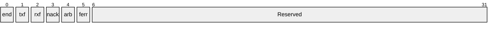

Although new programmming languages like RUST begin to gain some tractions in embedded system,
C programming language still dominates. The classic [C
textbook](https://en.wikipedia.org/wiki/The_C_Programming_Language),
authored by Brian and Dennis, is the bible for embedded software engineers.

C programmming language is a big topic. It has many concepts including control flow
(if/else/while/for), functions, array, pointer, structure, and the rich set of C libararies.
However, we focus on the several specific areas that are associated with hardware closely.

# alignment in structure
It is known that a variable of type uint8_t is one byte length, a variable of type uint16_t is
two bytes long, and a variable of uint32_t is four bytes long. However the structure below might
not be seven bytes long.
```c
typedef struct {
    uint8_t  a;
    uint16_t b;
    uint32_t c;
} test_t;
```
Instead, it could be 8 bytes long because of the alignment. There is a unnamed hole
between the first two fields, which means a is not followed by b in the memory. The hole is one
byte long because the second field b is 2 bytes(16 bits) long. Together the first two fields
(a, b) occupy 4 bytes. It is perfectly aligned with the next object c (4 bytes too). Thus the
total length of the structure is 8 bytes.

Given this, embedded system program usually avoid the unnamed holes by two ways. The first way
is to re-arrange the fields in the structure if allowed. For example,
```c
typedef struct {
    uint8_t  a;
    uint16_t b;
    uint8_t  c;
    uint32_t d;
} demo_not_prefer;
```
will be changed to
```c
typedef struct {
    uint8_t  a;
    uint8_t  c;
    uint16_t b;
    uint32_t d;
} demo_prefer;
```
In case re-arranging field is not an option, the 2nd way is to explictely add the aligned
filler. The first structure will be re-rewritten as
```c
typedef struct {
    uint8_t  a;
    uint8_t  unused;
    uint16_t b;
    uint32_t c;
} demo_filler;
```
The compiler may provide means to alleviate the issue as well if portability is not concern. For
example, GCC provides the option of  \_\_attribute\_\_((packed)) to pack all fields using the
smallest possible alignment. With this, the structure mentioned in the beginning of this section
can occupy 7 bytes only.
```c
typedef struct __attribute__((packed)) {
    uint8_t  a;
    uint16_t b;
    uint32_t c;
} test_t;
```

You might notice that the integer type of **int** is not used here. C language standard defines
the type of **int** is at least 4 bytes. Using it might cause portablity problems. On contrast,
the integer type of **uint32_t** is guranteed to be 32 bits long.

Alignment is a very critical concept that needs to be considered in embedded system software.
Job interviews for low-level programming always bring the topic to candidates. Here are more
examples you can give it a try. What is the size of below structures?

```c
typedef struct {
    uint8_t c;
    uint32_t b;
    uint16_t a;
} test1_t;

typedef struct {
    uint32_t b;
    uint8_t c;
    uint16_t a;
} test2_t;

typedef struct {
    uint8_t c;
    uint8_t a;
    uint32_t b;
} test3_t;

typedee struct {
    uint8_t c;
    uint32_t b;
    uint8_t a;
} test4_t;

typedef struct {
    uint32_t b;
    uint8_t c;
    uint16_t a;
} test5_t;

typedef struct {
    uint8_t c;
    uint16_t a;
    uint64_t b;
} test6_t;

typedef struct {
    uint64_t b;
    uint8_t c;
    uint16_t a;
} test7_t;

typedef struct{
    uint8_t c;
    uint64_t b;
    uint16_t a;
} test8_t;

typedef struct {
    uint64_t b;
    uint8_t c;
    uint32_t a;
} test9_t;
```

# bit field
In the hardware word, not all of fields are in bytes or words. Instead, in order to save the
register space, several fields, each of them with several bits, are packed and represented in a
single register. The example of a I2C register is like this (NOTE: the layout is usually presented
from highest bits to lowest bits in hardware manual).

Here is the typical definition of data structure for a register which consists
of several bit fields.
```c
    union {
        struct {
            uint32_t i2c_end_int:1;    /* [    0],          r,        0x0 */
            uint32_t i2c_txf_int:1;    /* [    1],          r,        0x0 */
            uint32_t i2c_rxf_int:1;    /* [    2],          r,        0x0 */
            uint32_t i2c_nak_int:1;    /* [    3],          r,        0x0 */
            uint32_t i2c_arb_int:1;    /* [    4],          r,        0x0 */
            uint32_t i2c_fer_int:1;    /* [    5],          r,        0x0 */
            uint32_t reserved_6_31:26; /* [31:6],       rsvd,        0x0 */
        } bit_fields;
        uint32_t val;
    } i2c_int_sts;
```
The union enables the structure of __bit\_fields__ to share the same 32-bits space as the field
of __val__. The field __reserved_6_31__ is a filler explicitely for the unused bits in the 32 bits
register. Such unused bits fields may be used in chip of next generation or used for software
purpose. It provides some sort of back-compatibility.

# pointer

# bits operation

# register read/write
