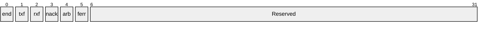

Although new programmming languages like RUST begin to gain some tractions in embedded system,
C programming language still dominates. The classic [C
textbook](https://en.wikipedia.org/wiki/The_C_Programming_Language),
authored by Brian and Dennis, is the bible for embedded software engineers.

C programmming language is a big topic. It has many concepts including control flow
(if/else/while/for), functions, array, pointer, structure, and the rich set of C libararies.
However, we focus on the several specific areas that are associated with hardware closely.

# alignment in structure
It is known that a variable of type uint8_t is one byte length, a variable of type uint16_t is
two bytes long, and a variable of uint32_t is four bytes long. However the structure below might
not be seven bytes long.
```c
typedef struct {
    uint8_t  a;
    uint16_t b;
    uint32_t c;
} test_t;
```
Instead, it could be 8 bytes long because of the alignment. There is a unnamed hole
between the first two fields, which means a is not followed by b in the memory. The hole is one
byte long because the second field b is 2 bytes(16 bits) long. Together the first two fields
(a, b) occupy 4 bytes. It is perfectly aligned with the next object c (4 bytes too). Thus the
total length of the structure is 8 bytes.

Given this, embedded system program usually avoid the unnamed holes by two ways. The first way
is to re-arrange the fields in the structure if allowed. For example,
```c
typedef struct {
    uint8_t  a;
    uint16_t b;
    uint8_t  c;
    uint32_t d;
} demo_not_prefer;
```
will be changed to
```c
typedef struct {
    uint8_t  a;
    uint8_t  c;
    uint16_t b;
    uint32_t d;
} demo_prefer;
```
In case re-arranging field is not an option, the 2nd way is to explictely add the aligned
filler. The first structure will be re-rewritten as
```c
typedef struct {
    uint8_t  a;
    uint8_t  unused;
    uint16_t b;
    uint32_t c;
} demo_filler;
```
The compiler may provide means to alleviate the issue as well if portability is not concern. For
example, GCC provides the option of  \_\_attribute\_\_((packed)) to pack all fields using the
smallest possible alignment. With this, the structure mentioned in the beginning of this section
can occupy 7 bytes only.
```c
typedef struct __attribute__((packed)) {
    uint8_t  a;
    uint16_t b;
    uint32_t c;
} test_t;
```

You might notice that the integer type of **int** is not used here. C language standard defines
the type of **int** is at least 4 bytes. Using it might cause portablity problems. On contrast,
the integer type of **uint32_t** is guranteed to be 32 bits long.

Alignment is a very critical concept that needs to be considered in embedded system software.
Job interviews for low-level programming always bring the topic to candidates. Here are more
examples you can give it a try. What is the size of below structures?

```c
struct test2 {
    uint8_t c;
    uint16_t a;
    uint32_t b;
};
struct test3 {
    uint8_t c;
    uint32_t b;
    uint16_t a;
};
struct test4 {
    uint8_t c;
    uint8_t a;
    uint32_t b;
};
struct test5 {
    uint8_t c;
    uint32_t b;
    uint8_t a;
};
struct test6 {
    uint32_t b;
    uint8_t c;
    uint16_t a;
};
struct test7 {
    uint8_t c;
    uint16_t a;
    uint64_t b;
};
struct test8 {
    uint64_t b;
    uint8_t c;
    uint16_t a;
};
struct test9 {
    uint8_t c;
    uint64_t b;
    uint16_t a;
};
struct test10 {
    uint64_t b;
    uint8_t c;
    uint32_t a;
};
```

# bit field
In the hardware word, not all of fields are in bytes or words. Instead, in order to save the
register space, several fields, each of them with several bits, are packed and represented in a
single register. The example of a I2C register is like this (NOTE: the layout is usually presented
from highest bits to lowest bits in hardware manual).

Here is the typical definition of data structure for a register which consists
of several bit fields.
```c
    union {
        struct {
            uint32_t i2c_end_int:1;    /* [    0],          r,        0x0 */
            uint32_t i2c_txf_int:1;    /* [    1],          r,        0x0 */
            uint32_t i2c_rxf_int:1;    /* [    2],          r,        0x0 */
            uint32_t i2c_nak_int:1;    /* [    3],          r,        0x0 */
            uint32_t i2c_arb_int:1;    /* [    4],          r,        0x0 */
            uint32_t i2c_fer_int:1;    /* [    5],          r,        0x0 */
            uint32_t reserved_6_31:26; /* [31:6],       rsvd,        0x0 */
        } bit_fields;
        uint32_t val;
    } i2c_int_sts;
```
The union enables the structure of __bit\_fields__ to share the same 32-bits space as the field
of __val__. The field __reserved_6_31__ is a filler explicitely for the unused bits in the 32 bits
register. Such unused bits fields may be used in chip of next generation or used for software
purpose. It provides some sort of back-compatibility.

# pointer
For programmers whose started their coding journey with non-C language, the challenging feature
in C is the concept of pointer. The closest analogy of the pointer is the mailbox in the life,
which stores letters or packages. For example, my mailbox is the number 7 of size of 5 x 5 inch
in the mailbox cluster at our neighborhood. The number *7* is the address of my mailbox. And the
maximum size it can hold is 5 inch x 5 inch.

Here is the definition of pointer, _A pointer in C is a variable that contains the address of a
variable_. Examples of pointers are like below:
```c
uint8_t *p_letter; /* a pointer called p_letter pointing to an unsigned 8-bit integer */
uint8_t a_letter = 0x76;

p_letter = &a_letter; /* p_letter points to the variable of a_letter */
```
In this example, *p_letter* is declared as a pointer which points to a type uint8_t variable, but
it is not initiazed. *a_letter* is declared a variable of type uint8_t. The assign statement
lets the *p_letter* points to the address of *a_letter*. With that, the notation of *\*p\_letter*
has the same value of *a_letter*.

Other than pointing to a basic type of variable, a pointer can be defined to point to a structure.
For example,
```c
struct time_demo {
    uint64_t seconds;
    uint64_t useconds;
};

struct time_demo *p_used;
```
Some commonly pitfalls of using address/pointers are worth of attention.
- operations on an uninitialized pointer.
- assumption that *pa + 1* is one byte beyond *pa*, given *pa* is a pointer.

The first one may cause unexpected behaviors of a program, which can be very hard to hunt down.
The symptom is that the program sometimes works while sometimes it does not work. And the second
one actually indicates that pa + 1 points to the next element if pa points to a partitular element
of an array. The number of bytes distance varies between *pa + 1* and *pa*, depending on the
type of variable that the pointer points to.

Back to the mailbox size topic, if the package is larger than 5 inch x 5 inch, post officer would
place the package into another giant mailbox, and leave the key of that giant mailbox in my mailbox.
In C programming language, this is achieved through the pointer pointing to a pointer, e.g.
```c
struct time_demo **pp_time_used; /* two stars */
```
However, this is not commonly used in firmware though. Safety requirements pose limits on the
way writing C programs, as far as I can see from my work experience.

In C program, the name of a function is stored in a memory address. Thus a pointer can be
defined to point to some type of functions.  For example,
```c
int (*compare)(const void *, const void *);
```
This defines *compare* as a pointer that points to functions that takes two pointer parameters,
and returns an integer.

Function pointer is widely used in driver when a call-back function needs to register upon
events happening.

Overall, pointer and address are much used in firmware. It would be used to address the
registers/memory when reading or writing, as well as function call-back. Other fancy complicated
pointer definitions are very difficult to grasp, even for seasonal C programmers. Sometimes,
interviewers bring it up to show off their skills, nothing more.

# bits operation
Hardware usually do not have luxury of spaces. Thus several fields may be crammed into a single
resgiter on most occasions. In those cases there are needs to make operations on the single
field of the register. The operations include clear, set, toggle.

## bits in an integer
For many hardware platform, registers are 32-bits wide. We assume this when presenting examples.
C provides a set of bit operators:
+ &, bitwise AND
+ |, bitwise inclusive OR
+ ^, bitwise exclusive OR
+ <<, left shift
+ \>\>, right shift
+ ~, one's complement

Do not get confused *&* and *|* with logic operators, *&&*, *||*, etc!

- **clear a single bit at position x**
This means set the value of a single bit to 0 (zero). Setting something to zero requires to use
bit-wise AND operation ( &). The other operand at that specific bit should be 0(zero), and the rest
of bits need to be 1(one). With that, the other bits in original value can be preserved. For example,
set bit of 6 in value of 0xF3 (0b1111 0011) to 0 (zero), the proposed operand need to be
(0b1111 1111 1111 1111 1111 1111 1011 1111).
That is to say, 0xF3 & 0xFFFF FFBF = 0xB3. The operand 0xFFFFFFBF has only one bit with value of
zero, that is bit 6, which can be achieved by complimenting (0x1 << 6).
```c
/* clear the bit at position x to zero */
bool clear_bit_x(uint32_t *p_out, uint32_t in, uint8_t x) {
    if (x >= 32 || p_out == NULL) {
        return false;
    }

    /*
     * val = (uint32_t) 1 << x;
     * val = ~ val;
     * *p_out = in & val;
     */
    *p_out = in & (~((uint32_t) 1 << x));
    return true;
}
```

- **clear multiple bits (n) starting from bit position x**
This set all n bits to 0 (zero) starting from bit position x. Similiarly this needs to use
bitwise-AND operation. Let's take an example before generalizing the solution. If n = 2, x =5,
this would clear the bit 5, 4. Based on what we leared from last example, the other operand
would be 0b1111 1111 1111 1111 1111 1111 1100 1111. It could be obtained from ~(0b11 0000).
The number 0b11 0000 has multiple bits set 0b11, which is (0b100 - 1). With that, we can
implement the solution like this. (1) ((1 << n) - 1) to get value a. (2) shift the number of
bits (x) left to get the operand (2) ~a to get the operand before shifting (4) do the & operation.
Please note the edge conditions like, n = 32 x = 31.
```c
/* clear the n bits starting from the bit at position x */
bool clear_n_bits_x(uint32_t *p_out, uint32_t in, uint8_t n, uint8_t x) {
    if (p_out == NULL) {
        return false;
    }
    if (n == 0) {
        *p_out = in;
        return true;
    }
    if (n > 32 || n + x > 32) {
        return false;
    }
    /*
     * val = ((uint32_t) 1 << n) - 1;
     * val = val << x;
     * val = ~val;
     * *p_out = in & val;
     */
    *p_out = in & ~((uint32_t)( ((uint64_t) 1 << n) - 1) << x);
    return true;
}
```

- **set a single bit at position x**
This means set the value of a single bit to 1 (one). Setting value to 1 requires to use bit-wise
inclusive OR operation (|). With the base of above discussion, this would be straightforward.
(1) 1 << x to get value a (2) |a with the operand to set the bit.
```c
/* set the bit at position x to one */
bool set_bit_x(uint32_t *p_out, uint32_t in, uint8_t x) {
    if (x >= 32) {
        return false;
    }
    /*
     * val = (uint32_t)1 << x;
     * *p_out = in | val;
     */
    *p_out = in | ((uint32_t) 1 << x);
    return true;
}
```

- **set multiple bits (n) starting from bit position x**
This set all n bits to 1 (one) starting from bit position x. This is similar to the section of
clearing multiple bits except this would use bit-wise inclusive OR (|). The example code is as
below.
```c
/* set the n-bits of value to 1 starting from position x */
bool set_n_bits_x(uint32_t *p_out, uint32_t in, uint8_t n, uint8_t x) {
    if(p_out == NULL) {
        return false;
    }
    if (n == 0) {
        *p_out = in;
        return true;
    }
    if (n >=32 || n + x >32) {
        return false;
    }

    /*
     * val = ((uint32_t) 1 << n) - 1;
     * val = val << x;
     * *p_out = in | val;
     */

    *p_out = in | ((((uint32_t) 1 << n) - 1) << x);
    return true;
}
```

- **toggle a single bit at position x**
This means set the value of a single bit to 1 (one) if current value is 0 (zero), otherwise to 0
(zero) if current value is 1 (one). This also needs an addtional operand to achieve the goal of
toggling. Of course, this can be done with naive switching statements, if-else.
```c
val = 1 << x;
if ((in & val) != 0) {
    // the bit is 1.
    out = in & (~val);
}
else {
    // the bit is zero
    out = in | val;
}
```
Exclusive OR (XOR)  has nice properties. When the two operands are different, the result is 1.
Otherwise the result is 0. We can just use the operand of (1 << x) with XOR. This operand has the
value of 1 at the position x. The bitwise exclusive OR (XOR) is useful in this case. If the
original value has 1 (one) in the position x,  (1 << x) ^ in would be 0 in that bit. Since the
rest of bits in (1 << x) are 0, XOR with value 0 results in 0, XOR with 1 results in 1. The
original bit values get preserved. Similiarly the same conclusion holds for the original value
being 0 in the position x.
```c
/* toggle bit x */
bool toggle_bit_x(uint32_t *p_out, uint32_t in, uint8_t x) {
    if(p_out == NULL) {
        return false;
    }

    /*
     * val = 1 << x;
     * *p_out = in ^ val;
     */
    *p_out = in ^ ((uint32_t) 1 << x);

    return true;
}
```

Unlike the previous sections regarding clearing and setting, this operation is used not quite
often in embedded system programmming.

- **toggle multiple bits (n) starting from bit position x**
This flips all n bits from position x to opposite values, 0 to 1, 1 to 0. This is similar to the
last section except it is multiple bits.
```c
/* toggle n bit starting from position x */
bool toggle_n_bits_x(uint32_t *p_out, uint32_t in, uint8_t n, uint8_t x) {
    if(p_out == NULL) {
        return false;
    }
    if (n == 0) {
        *p_out = in;
        return true;
    }
    if (n >=32 || n + x > 32) {
        return false;
    }

    *p_out = in ^ ((((uint32_t) 1 << n) - 1) << x);
    return true;
}
```

- **set a specific value to a multiple bit field**
This set the value of multiple consecutive bits starting from position x to a target value.
In order to do this, we have to mask off the respective bits to all zeros. After that, OR the
value with the target values starting from the position x.
```c
/* set the value of n bits from position x to target_val in original value in */
bool set_value_x(uint32_t *p_out, uint32_t in, uint32_t target_val,
        uint8_t n, uint8_t x) {

    if(p_out == NULL) {
        return false;
    }
    /* intentionally ignore checking other parameters */
    uint32_t mask = ~((((uint32_t) 1 << n) - 1) << x);

    *p_out = (in & mask) | target_val;
    return true;
}
```

Setting or clearing bits are often used in firmware software programming. Practically each
company may use it in different ways. Macros, such as mask for fields, are generated directly
from hardware manuals for facilitating software. Here is a typical example from BL602. For I2C
FIFO configuration register 1,

The macros for software programming are as follows.
```c
/* 0x84 : i2c_fifo_config_1 */
#define I2C_FIFO_CONFIG_1_OFFSET                                (0x84)
#define I2C_TX_FIFO_CNT                                         I2C_TX_FIFO_CNT
#define I2C_TX_FIFO_CNT_POS                                     (0U)
#define I2C_TX_FIFO_CNT_LEN                                     (2U)
#define I2C_TX_FIFO_CNT_MSK                                     (((1U<<I2C_TX_FIFO_CNT_LEN)-1)<<I2C_TX_FIFO_CNT_POS)
#define I2C_TX_FIFO_CNT_UMSK                                    (~(((1U<<I2C_TX_FIFO_CNT_LEN)-1)<<I2C_TX_FIFO_CNT_POS))
#define I2C_RX_FIFO_CNT                                         I2C_RX_FIFO_CNT
#define I2C_RX_FIFO_CNT_POS                                     (8U)
#define I2C_RX_FIFO_CNT_LEN                                     (2U)
#define I2C_RX_FIFO_CNT_MSK                                     (((1U<<I2C_RX_FIFO_CNT_LEN)-1)<<I2C_RX_FIFO_CNT_POS)
#define I2C_RX_FIFO_CNT_UMSK                                    (~(((1U<<I2C_RX_FIFO_CNT_LEN)-1)<<I2C_RX_FIFO_CNT_POS))
#define I2C_TX_FIFO_TH                                          I2C_TX_FIFO_TH
#define I2C_TX_FIFO_TH_POS                                      (16U)
#define I2C_TX_FIFO_TH_LEN                                      (1U)
#define I2C_TX_FIFO_TH_MSK                                      (((1U<<I2C_TX_FIFO_TH_LEN)-1)<<I2C_TX_FIFO_TH_POS)
#define I2C_TX_FIFO_TH_UMSK                                     (~(((1U<<I2C_TX_FIFO_TH_LEN)-1)<<I2C_TX_FIFO_TH_POS))
#define I2C_RX_FIFO_TH                                          I2C_RX_FIFO_TH
#define I2C_RX_FIFO_TH_POS                                      (24U)
#define I2C_RX_FIFO_TH_LEN                                      (1U)
#define I2C_RX_FIFO_TH_MSK                                      (((1U<<I2C_RX_FIFO_TH_LEN)-1)<<I2C_RX_FIFO_TH_POS)
#define I2C_RX_FIFO_TH_UMSK                                     (~(((1U<<I2C_RX_FIFO_TH_LEN)-1)<<I2C_RX_FIFO_TH_POS))
```

## byte in an integer
An integer of integer types other than uint8\_t (including char, etc), contains multiple bytes.
Data operation in embedded system are usually involved with four bytes (word) while the number
of input could be any number of bytes. This requires to pack the bytes in unit of words. For
example, user has the bytes of data: {0x11, 0x22, 0x33, 0x44, 0x55, 0x66, 0x77, 0x88, 0x99}, to
send to I2C device in words (4 bytes). Here is the sample code on packing.
```c
#include <stdio.h>
#include <stdlib.h>
#include <stdint.h>

int main(int argc, char *argcv[]) {
    uint8_t array[] = {
        0x11, 0x22, 0x33, 0x44, 0x55, 0x66, 0x77, 0x88, 0x99
    };
    int i = 0;
    uint32_t val = 0;
    int j = 0;

    for (i = 0; i < sizeof(array)/ sizeof(array[0]); i++) {
        val |= array[i] << ((i % 4) * 8);
        j++;
        if ((j % 4) == 0 || (i == sizeof(array) / sizeof(array[0]) - 1) ) {
            printf("i = %d val = 0x%x\n", i, val);
            val = 0;
            j = 0;
        }
    }
    return 0;
}
```
The real example is [I2c write](https://github.com/pine64/bl_iot_sdk/blob/534ee8f59fdfe222d7d143837ecd453ea5778ad2/components/bl602/bl602_std/bl602_std/StdDriver/Src/bl602_i2c.c#L469). The code from line 469 to line 494 can be simplified as below.
```c
    uint32_t j = 0;
    for(i = 0; i < cfg->dataSize; i++){
        /* build the 4 byte word with shifting x8 bits */
        temp += (cfg->data[i] << ((i % 4) * 8));
        j++;
        /* write the word every 4 bytes or the last byte is met */
        if((j % 4 == 0) || (i == cfg->dataSize - 1)){
            timeOut = I2C_FIFO_STATUS_TIMEOUT;
            while(BL_GET_REG_BITS_VAL(BL_RD_REG(I2Cx, I2C_FIFO_CONFIG_1), I2C_TX_FIFO_CNT) == 0){
                timeOut--;
                if(timeOut == 0){
                    I2C_Disable(i2cNo);
                    return TIMEOUT;
                }
            }
            BL_WR_REG(I2Cx, I2C_FIFO_WDATA, temp);
            temp = 0;
            j = 0;
        }
    }
```

# register read/write

When the pointer of C programming was discussed above, *address* was mentioned. It is very true
that it is used when CPU need to access a hardware register. Which/where is the register? This
is about addressing. Most of contemporary CPU architectures use the same ways of accessing
registers as the way to accessing memory, called memory-mapped IO.

If a register is located at address *addr*, the access of the value at the address would be
```c
val = *addr;
```
A SOC may consist of many registers belonging to different devices, such as UART, I2C, GPIO,
etc. Thus normally ech device has a dedicated address range, called addressing space. Hardware
manuals give a adress for a particular register within that addressing space. For example, BL602
has the I2C base address defined as
```c
#define I2C_BASE                ((uint32_t)0x4000A300)
```
And one of I2C registers is FIFO configuration 1.
```c
#define I2C_FIFO_CONFIG_1_OFFSET   (0x84)
```
The abolute address that CPU uses to access this register is base + offset, as the offset itself
is within the I2C device. Reading this register would be like:
```c
uint32_t val = *(I2C_BASE + I2C_FIFO_CONFIG_1_OFFSET);
```

In order to deal with registers from devices, usually macros are defined to handle this
systematically and elegantly.
```c
#define BL_RD_WORD(addr)                (*((volatile uint32_t*)(addr)))
#define BL_RD_REG(addr,regname)         BL_RD_WORD(addr+regname##_OFFSET)
#define BL_WR_REG(addr,regname,val)     BL_WR_WORD(addr+regname##_OFFSET,val)
```

It is worthy of noting the use of *\*volatile uint32_t*. This would prevent compiler optimizing
the code accidently, which could result in subtle bugs that is very hard to find out.
