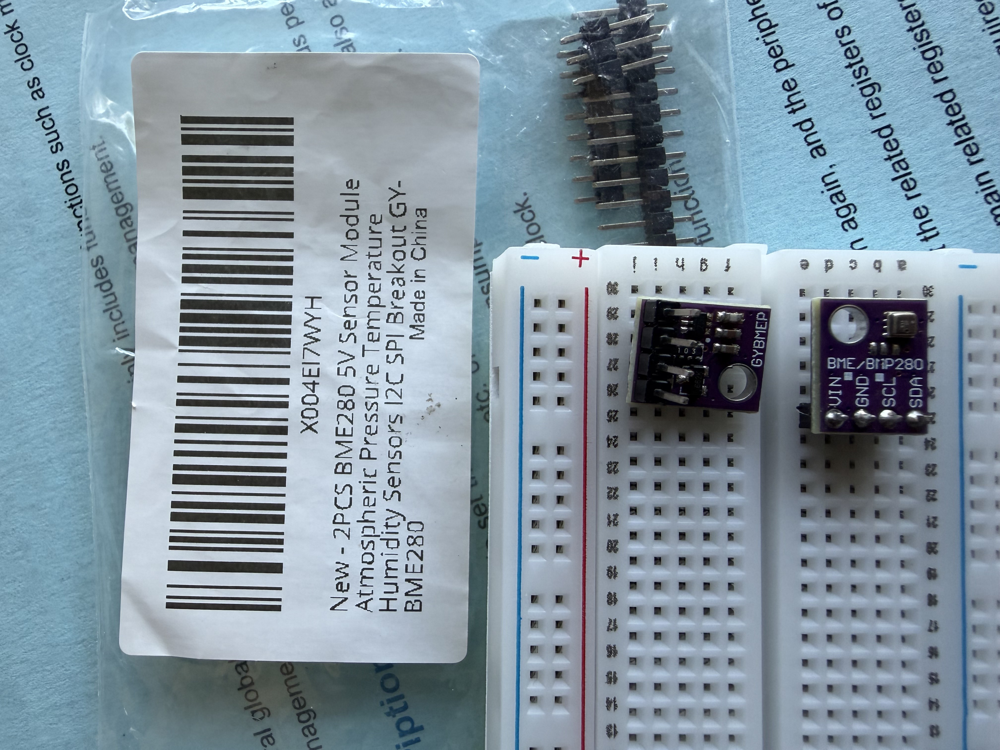
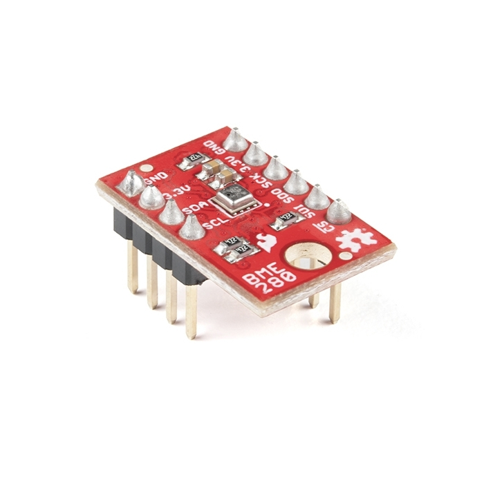
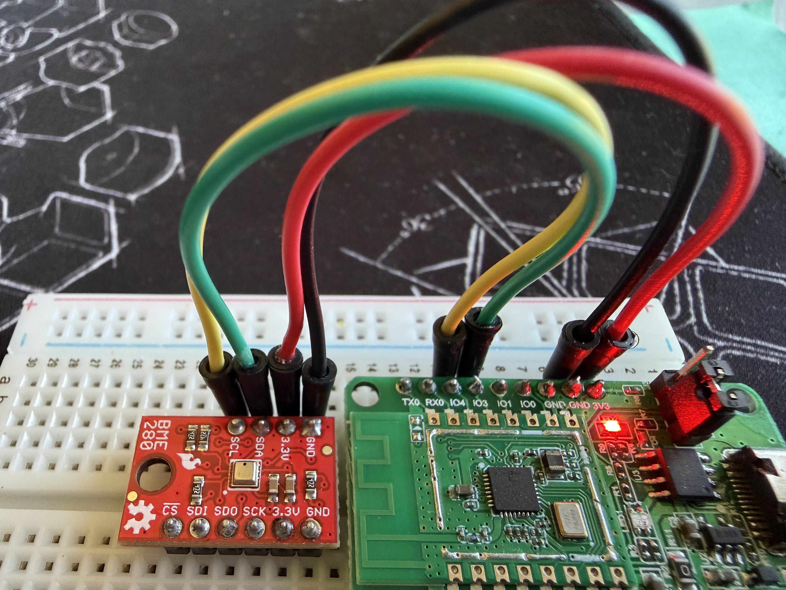
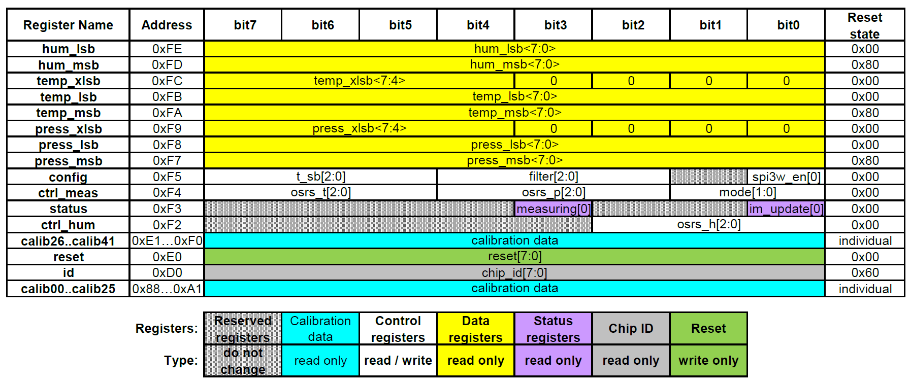
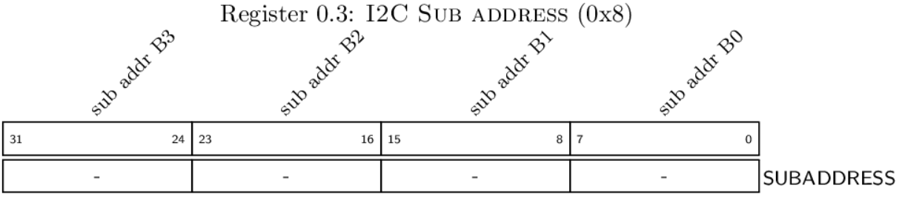

# Read temperatures and humidity from BME 280

BME 280 is a combined digital humidity, pressure and temperature sensor from Bosch Sensortec.
It provides I2C or SPI interface for connection. The data sheet is available at
[BME280](https://www.bosch-sensortec.com/media/boschsensortec/downloads/datasheets/bst-bme280-ds002.pdf)
. There are quite a few choices when buying from the market. I purchased one from
[Amazon](https://www.amazon.com/BME280/s?k=BME280), and another one from
[Sparkfun](https://www.sparkfun.com/sparkfun-atmospheric-sensor-breakout-bme280.html).
I will decribe the difference between them later on.

Connecting BME 280 to the BL602 based pine cone and making it work requires to understand
several things: (1) Which interface is used for the communication between them? (2) Which pins of
BL602 connects to the pins of BME 280? (3) How BME 280 gets programmed to read
humidity/pressure/temperature?

## Which interface is used for ocmmunication between BL602 and the BME 280?

The BME 280 module purchased from Amazon has four pins marked as **VIN, GND, SCL, and SDA**.
Though this product is marketed as I2C/SPI compatible, I assume it supports I2C officially.
(The sale page said it is 5V sensor module, the experiment seems to indicate 3.3v works OK too.)



The BME 280 module from Sparkfun has two sets of pins. One set consists of **GND, 3.3V, SDA,
and SCL**, and the second set pins consists of **\_CS, SDI, SDO, SCK, 3.3v, and GND**. This
module clearly supports both SPI and I2C.



Thus, I would choose I2C interface for the sake of both BME 280 modules.

## Which pins of BL602 connects to the pins of BME280?

[BL602/BL604 reference
manual](https://github.com/pine64/bl602-docs/blob/b214ef8e4fdef06de528dd6fc5d8e7da24c19159/mirrored/Bouffalo%20Lab%20BL602_Reference_Manual_en_1.1.pdf)
page 27/209 shows that there are 23 pins. The BL602 board of Pine64 reference design has 18
pins. These pins can be configured into different GPIO functions, including I2C. Take the
example of I2C, GPIO_0/GPIO_1, GPIO_2/GPIO_3, GPIO_4/GPIO_5,....,GPIO_20/GPIO_21 can be
configured to SCL/SDA for I2C port.

Technically you see many pairs of pins can be used for I2C simutaniously. Yet, this is not
necessary true. The reference code of BL602 configures the GPIO pin 3 and GPIO 4 for I2C,
nothing else.
```c
 /* hal_drv/bl602_hal/bl_i2c.c */
 57 void i2c_gpio_init(int i2cx)
 58 {
 59     uint8_t gpiopins[2];
 60     if (i2cx == I2C0) {
 61         gpiopins[0] = GLB_GPIO_PIN_4;
 62         gpiopins[1] = GLB_GPIO_PIN_3;
 63     } else {
 64     }
 65
 66     GLB_GPIO_Func_Init(GPIO_FUN_I2C, gpiopins, sizeof(gpiopins) / sizeof(gpiopins[0]));
 67     return;
 68 }
```

This is not the worst. If I2C registers are provided for all I2C ports, it is possible to add
additional support of other I2C ports. But this piece is missing in the reference code, and
related reference manual. I may poke around this in future.

Based on this, we would use GPIO pin 3 and 4 to connect BME 280. Here is the connection.


## How BME 280 gets programmed to read humidity/pressure/temperature?

Knowing to use I2C is not enough. In order to know how to milk the BME 280 and drive it work,
we have to read the [data
sheet](https://www.bosch-sensortec.com/media/boschsensortec/downloads/datasheets/bst-bme280-ds002.pdf).

The BME 280 register maps are shown below:


Apparently read-only registers are not configurable. They exist for retrieving. Among them are
humidity registers, temperature registers, pressure registers, calibration register, and id
register. Other than reset register (0xE0), this leaves three registers only: config register
(0xF5), ctrl_meas register (0xF4), and ctrl_hum register (0xF2).

- register **ctrl_hum** (0xF2)

| [7:3]  |  [2:0] |
| ------ | ------ |
| unused | osrs_h[2:0] |

The field *osrs_h* is oversampling register settings for humidity (osrs_h).

| osrs_h[2:0] | humidity oversampling |
| ----------- | ------------- |
| 000          | skipped (output set to 0x8000)  |
| 001          | oversampling x1  |
| 010          | oversampling x2  |
| 011          | oversampling x4  |
| 100          | oversampling x8  |
| 101, others  | oversampling x16 |

This instructs how many samples of humidity the sensor collects for single reading session.
The samples are filtered if necessary when configured so.

- register **ctrl_meas** (0xF4)

|    [7:5]    |    [4:2]    |   [1:0]   |
| ----------- | ----------- | --------- |
| osrs_t[2:0] | osrs_p[2:0] | mode[1:0] |

The fields *osrs_t* and *osrs_p* are the same as the field of *osrs_h* described above. The
field *mode* is the setting on how the sensor operates. It supports the following:

| mode[1:0]  |     mode    |
| ---------- | ----------- |
|   00       |  sleep mode |
|   01/10    |  forced mode|
|   11       | normal mode |

- register **config** (0xF5)

|      [7:5]      |  [4:2] | [1:1] |       [0:0]       |
| ------------    | ------ |-------|-------------------|
| time of standby | filter |  -    | enable 3-wire spi |

The time of standby settings is defined as below:

|   t_sb[2:0]  |  time of standby [ms] |
| -----------  | ------------------- |
| 000          |        0.5          |
| 001          |        62.5         |
| 010          |        125          |
| 011          |        250          |
| 100          |        500          |
| 101          |        1000         |
| 110          |        10           |
| 111          |        20           |

, and the filter settings is as follows:

| filter[2:0] | filter coefficient |
| ----------- | ------------- |
| 000          | filter off  |
| 001          | 2  |
| 010          | 4  |
| 011          | 8  |
| 100, others  | 16 |

These registers are the ones that we are going to program. For the simplicity,
I will use forced-mode, oversampling being set to 1, and read the data from the registers
from 0xF7 to 0xFE. In summary, the tables show the values to be programmed:

| ctrl_hum (0xF2) |  ctrl_meas (0xF4) | config (0xF5) |
| --------------- | ----------------- | ------------- |
|    0x1          |     0x25          |     -         |

The data read from the registers are raw, which means it needs to process further to
get human-friendly information. The data sheet provides the compensation formular to do the
conversion, with the data in calibration registers (0x88 ~ 0xA1, and 0xE1 ~ 0xF0). Please
refer to the above mentioned BME 280 data sheet for the formular.

## I2C in BL 602

I2C is a two-wire simple serial communication protocols intended to exchange data between a
pair of devices, one of them being a master, and another being a slave. You can find a brief of
introduction [here](https://www.ti.com/lit/pdf/sbaa565), or the I2C specification at
[NXP](https://www.nxp.com/docs/en/user-guide/UM10204.pdf).

The code support of I2C in BL602 spread in the list of below files.
+ ./components/bl602/bl602_std/bl602_std/StdDriver/Src/bl602_i2c.c
+ ./components/bl602/bl602_std/bl602_std/Device/Bouffalo/BL602/Peripherals/i2c_reg.h
+ ./components/hal_drv/bl602_hal/bl_i2c.c
+ ./components/hal_drv/bl602_hal/hal_i2c.c

bl602_i2c.c implements the driver for I2C device in BL602. bl_i2c.c hides the hardware details
while hal_i2c.c provides hardware abstract functions for TinyOS specific. The BL602 reference
[manual](https://github.com/pine64/bl602-docs/blob/b214ef8e4fdef06de528dd6fc5d8e7da24c19159/mirrored/Bouffalo%20Lab%20BL602_Reference_Manual_en_1.1.pdf)
provides the usage of I2C guide. Here are the steps:
- Set I2C clock
- Configure I2C
    - read/write flag
    - slave address
    - register address in the I2C slave device
    - register address lengh in the I2C slave device
    - data length
- enable signal to kick off the I2C transaction
- write or read from/to data buffer to/from I2C write/read register
- stop the transaction

Here are the configure register, interrupt status register, and the address register in I2C
device (called I2C sub-address in BL602).




There are several ways to use the I2C in BL602, including polling, interrupt, or DMA mode. In
the simple use case of BME 280, I will use polling.

## The code
As usual, I did this hacky way by patching bootloader to keep reading BME280, and dumping the
data on UART log. The code reads the register of BME280 from the calibration to the end of
sensor register though periodially reading registers other than humidity and temperature is not
necessary as the calibration data remains not changed all the way.

The compensation formula is from BME 280 datasheet. Here is the code snipet.
```c
diff --git a/customer_app/bl602_boot2/Makefile b/customer_app/bl602_boot2/Makefile
index 26a4265d..1179a87b 100755
--- a/customer_app/bl602_boot2/Makefile
+++ b/customer_app/bl602_boot2/Makefile
@@ -20,6 +20,7 @@ $(info ****** Trying SDK PATH [$(BL60X_SDK_PATH)])
 endif

 INCLUDE_COMPONENTS += bl602 bl602_std
+INCLUDE_COMPONENTS += hal_drv freertos_riscv_ram utils blog cli yloop vfs blfdt loopset looprt bloop bl602_wifi
 INCLUDE_COMPONENTS += bl602_boot2

 include $(BL60X_SDK_PATH)/make_scripts_riscv/project.mk
diff --git a/customer_app/bl602_boot2/bl602_boot2/blsp_boot2.c b/customer_app/bl602_boot2/bl602_boot2/blsp_boot2.c
index 2e705dbc..0b151a00 100644
--- a/customer_app/bl602_boot2/bl602_boot2/blsp_boot2.c
+++ b/customer_app/bl602_boot2/bl602_boot2/blsp_boot2.c
@@ -36,6 +36,9 @@
 #include "blsp_boot_decompress.h"
 #include "blsp_common.h"
 #include "softcrc.h"
+#include <i2c_reg.h>
+#include <bl_i2c.h>
+#include <bl602_i2c.h>

 /** @addtogroup  BL606_BLSP_Boot2
  *  @{
@@ -378,6 +381,435 @@ static void BLSP_Boot2_Get_MFG_StartReq(PtTable_ID_Type activeID,PtTable_Stuff_C
  *  @{
  */

+#define I2C_TIMEOUT     (160 * 1000 * 2)
+static void dump_i2c(void) {
+    uint32_t val0 = BL_RD_REG(I2C_BASE, I2C_CONFIG);
+    uint32_t val1 = BL_RD_REG(I2C_BASE, I2C_INT_STS);
+    uint32_t val2 = BL_RD_REG(I2C_BASE, I2C_SUB_ADDR);
+    uint32_t val3 = BL_RD_REG(I2C_BASE, I2C_FIFO_CONFIG_0);
+    uint32_t val4 = BL_RD_REG(I2C_BASE, I2C_FIFO_CONFIG_1);
+    MSG_DBG("- 0x%08x 0x%08x 0x%08x 0x%08x 0x%08x \r\n",
+            val0,
+            val1,
+            val2,
+            val3,
+            val4
+            );
+}
+
+static void i2c_init_local(void) {
+    i2c_gpio_init(0); /* I2C port 0 */
+    i2c_set_freq(500, 0); /* 500 khz */
+    I2C_Disable(0); /* disable port 0 */
+    I2C_IntMask(0, I2C_INT_ALL, MASK);
+}
+
+static void i2c_stop_local(i2c_msg_t *p_msg) {
+    I2C_Disable(p_msg->i2cx);
+    I2C_IntMask(p_msg->i2cx, I2C_INT_ALL, MASK);
+    i2c_clear_status(p_msg->i2cx);
+}
+
+static int i2c_read_local(i2c_msg_t *p_msg) {
+    int ret_code = 0;
+    uint32_t timeout = 0;
+    uint32_t i = 0, j = 0, k = 0;
+    uint32_t val = 0;
+    uint32_t left = p_msg->len;
+
+    while(i < p_msg->len) {
+        timeout = 5000;
+        while (BL_GET_REG_BITS_VAL(BL_RD_REG(I2C_BASE, I2C_INT_STS), I2C_RXF_INT) == 0) {
+            timeout--;
+            ARCH_Delay_MS(1);
+            if (timeout == 0) {
+                MSG_ERR("\ntimeout in waiting rx_interrupt\r\n");
+                MSG_ERR("0x%08x 0x%08x 0x%08x 0x%08x\r\n",
+                    BL_RD_REG(I2C_BASE, I2C_BUS_BUSY),
+                    BL_RD_REG(I2C_BASE, I2C_INT_STS),
+                    BL_RD_REG(I2C_BASE, I2C_FIFO_CONFIG_1),
+                    BL_RD_REG(I2C_BASE, I2C_FIFO_CONFIG_0));
+                ret_code = -1;
+                goto fail;
+            }
+        }
+        val = BL_RD_REG(I2C_BASE, I2C_FIFO_RDATA);
+        if (left >=4)
+            j = 4;
+        else
+            j = left;
+        for (k = 0; k < j; k++) {
+            MSG_DBG("0x%02x ", (val >> (k * 8)) & 0xff);
+            p_msg->buf[p_msg->idex] = (val >> (k * 8)) & 0xff;
+            p_msg->idex++;
+        }
+        MSG_ERR("\r\n");
+        i = i + 4;
+        left -= j;
+    }
+
+    /* wait for I2C bus idle */
+    timeout = 5000; //I2C_TIMEOUT; // reload timeout value
+    while (BL_GET_REG_BITS_VAL(BL_RD_REG(I2C_BASE, I2C_BUS_BUSY), I2C_STS_I2C_BUS_BUSY) != 0) {
+        timeout--;
+        ARCH_Delay_MS(1);
+        if (timeout == 0) {
+            MSG_ERR("\ntimeout in waiting I2C idle\r\n");
+            ret_code = -1;
+            goto fail;
+        }
+    }
+
+fail:
+    return ret_code;
+}
+
+/* write transaction */
+static int i2c_write_local(i2c_msg_t *p_msg) {
+    int ret_code = 0;
+    uint32_t timeout = 0;
+    uint32_t i = 0;
+    uint32_t j = 0;
+    uint32_t val = 0x0;
+
+    timeout = I2C_TIMEOUT;
+    for (i = 0; i < p_msg->len; i++) {
+        val = val | (p_msg->buf[i] << ((i % 4) * 8));
+        j++;
+        p_msg->idex++;
+        if ((j % 4) == 0 || i == p_msg->len - 1) {
+            while (BL_GET_REG_BITS_VAL(BL_RD_REG(I2C_BASE, I2C_INT_STS), I2C_TXF_INT) == 0) {
+                timeout--;
+                if (timeout == 0) {
+                    MSG_ERR("\ntimeout in waiting tx_fifo space\r\n");
+                    ret_code = -1;
+                    goto fail;
+                }
+            }
+#if 0
+            MSG_DBG("val = 0x%x\r\n", val);
+#endif
+            BL_WR_REG(I2C_BASE, I2C_FIFO_WDATA, val);
+            j = 0;
+            val = 0;
+        } // if 4 bytes
+    } // for loop
+
+    /* XXX: why adding this dump helps the success of I2C write ??? */
+    dump_i2c();
+
+    /* wait for I2C bus idle */
+    timeout = I2C_TIMEOUT; // reload timeout value;
+    while (BL_GET_REG_BITS_VAL(BL_RD_REG(I2C_BASE, I2C_BUS_BUSY), I2C_STS_I2C_BUS_BUSY) != 0) {
+        timeout--;
+        if (timeout == 0) {
+            MSG_ERR("\ntimeout in waiting I2C idle\r\n");
+            ret_code = -1;
+            goto fail;
+        }
+    }
+
+fail:
+    return ret_code;
+}
+
+#define BME_CALIB_00    0x88
+#define BME_CHIP_ID     0xD0
+#define BME_SOFT_RESET  0xE0
+#define BME_CTRL_HUM    0xF2 /* [2:0] humidy oversamping */
+#define BME_STATUS      0xF3
+#define BME_CTRL_MEAS   0xF4 /* [7:5] temp oversamping, [4:2] pressure oversamping, [1:0] mode */
+#define BME_CONFIG      0xF5
+
+#define BME_PRES_MSB    0xF7
+#define BME_PRES_LSB    0xF8
+#define BME_PRES_XLSB   0xF9
+
+#define BME_TEMP_MSB    0xFA
+#define BME_TEMP_LSB    0xFB
+#define BME_TEMP_XLSB   0xFC
+
+#define BME_HUM_MSB     0xFD
+#define BME_HUM_LSB     0xFE
+
+/* the field in BME_CTRL_MEAS register */
+#define CTRL_PRESSURE_POS    2
+#define CTRL_PRESSURE_LEN    3
+#define CTRL_TEMP_POS        5
+#define CTRL_TEMP_LEN        3
+#define CTRL_MODE_POS        0
+#define CTRL_MODE_LEN        2
+/* the field in BME_CTRL_HUM */
+#define CTRL_HUM_POS        0
+#define CTRL_HUM_LEN        3
+
+#define OVER_SAMPLE_SKIP    0
+#define OVER_SAMPLE_ONE     1
+#define OVER_SAMPLE_TWO     2
+#define OVER_SAMPLE_FOUR    3
+#define OVER_SAMPLE_EIGHT   4
+#define OVER_SAMPLE_SIXTEEN 5
+
+#define MODE_SLEEP          0
+#define MODE_FORCED         1 /* 2 is also forced */
+#define MODE_NORMAL         3
+
+uint8_t bme280_addr = 0x77;
+
+static int bme_read(uint8_t addr, uint8_t sub_addr, uint8_t *p_buf, uint32_t len) {
+    int ret_code = 0;
+    i2c_msg_t msg = {
+        .addr = addr,
+        .direct = I2C_READ,
+        .subflag = 1,
+        .subaddr = sub_addr, /* reg address in the BME */
+        .sublen = 1,
+        .buf = p_buf,
+        .len = len,
+        .block = I2C_M_BLOCK,
+        .idex = 0,
+        .i2cx = 0,
+    };
+
+    i2c_init_local();
+    i2c_transfer_start(&msg);
+    dump_i2c();
+    ret_code = i2c_read_local(&msg);
+    i2c_stop_local(&msg);
+
+    return ret_code;
+}
+
+static int bme_write(uint8_t addr, uint8_t sub_addr, uint8_t *p_buf, uint32_t len) {
+    int ret_code = 0;
+    i2c_msg_t msg = {
+        .addr = addr,
+        .direct = I2C_WRITE,
+        .subflag = 1,
+        .subaddr = sub_addr, /* reg address in the BME */
+        .sublen = 1,
+        .buf = p_buf,
+        .len = len,
+        .block = I2C_M_BLOCK,
+        .idex = 0,
+        .i2cx = 0,
+    };
+
+    i2c_init_local();
+    i2c_transfer_start(&msg);
+    dump_i2c();
+    ret_code = i2c_write_local(&msg);
+    i2c_stop_local(&msg);
+
+    return ret_code;
+}
+
+uint8_t read_BME280_chipid(void) {
+    int ret_code = 0;
+    uint8_t reset_cmd = 0xB6;
+    uint8_t reset_addr = BME_SOFT_RESET;
+    uint8_t chipid_addr = BME_CHIP_ID;
+    uint8_t chip_id = 0x0;
+
+    /* reset bme280  */
+    ret_code = bme_write(bme280_addr, reset_addr, &reset_cmd, sizeof (reset_cmd));
+    if (ret_code < 0) {
+        goto fail;
+    }
+
+    /* now read chip id */
+    ARCH_Delay_MS(50);
+    ret_code = bme_read(bme280_addr, chipid_addr, &chip_id, sizeof (chip_id));
+    if (ret_code < 0) {
+        goto fail;
+    }
+
+fail:
+    return chip_id;
+}
+
+/* configure oversampling for pressure/temperature/humidy */
+int config_BME280(uint8_t os_p, uint8_t os_t, uint8_t os_h, uint8_t mode) {
+    int ret_code = 0;
+    uint8_t val = 0;
+    uint8_t ctrl_hum_addr = BME_CTRL_HUM;
+    uint8_t ctrl_meas_addr = BME_CTRL_MEAS;
+
+    if (os_p > ((1 << CTRL_PRESSURE_LEN) - 1) || os_t > ((1 << CTRL_TEMP_LEN) - 1)
+            || os_h > ((1 << CTRL_HUM_LEN) - 1) || mode > ((1 << CTRL_MODE_LEN) - 1)) {
+       MSG_ERR("ERROR: invalid parameters\r\n");
+       return -1;
+    }
+
+    ARCH_Delay_MS(5);
+    /* config humidity oversamping */
+    val = (os_h << CTRL_HUM_POS) | (val & ( ~(((1 << CTRL_HUM_LEN) - 1) << CTRL_HUM_POS)));
+#if 0
+    MSG_DBG("os_h=0x%x\r\n", val);
+#endif
+    ret_code = bme_write(bme280_addr, ctrl_hum_addr, &val, sizeof(val));
+    if (ret_code < 0) {
+        goto fail;
+    }
+
+#if 0 /* skip other config */
+    uint8_t config_addr = 0xF5;
+    ARCH_Delay_MS(5);
+    val = 0x48;
+    bme_write(bme280_addr, config_addr, &val, sizeof(val));
+#endif
+
+    ARCH_Delay_MS(5);
+    /* config temperature and pressure */
+    val = (os_p << CTRL_PRESSURE_POS);
+    val |= (os_t << CTRL_TEMP_POS) | (val & (~((( 1 << CTRL_TEMP_LEN) - 1) << CTRL_TEMP_POS)));
+    val |= (mode << CTRL_MODE_POS) | (val & (~((( 1 << CTRL_MODE_LEN) - 1) << CTRL_MODE_POS)));
+#if 0
+    MSG_DBG("os_ptm=0x%x\r\n", val);
+#endif
+    ret_code = bme_write(bme280_addr, ctrl_meas_addr, &val, sizeof(val));
+    if (ret_code < 0) {
+        goto fail;
+    }
+
+fail:
+    return ret_code;
+}
+
+/* t_fine is calculated in get_temperature, but used in humidity */
+static int32_t t_fine = 0;
+
+static void get_T1(uint16_t *p_T1, uint8_t *p_data) {
+    *p_T1 = (p_data[0x89 - 0x88] << 8) | (p_data[0x88 - 0x88]);
+}
+
+static void get_T2(int16_t *p_T2, uint8_t *p_data) {
+    *p_T2 = (p_data[0x8B - 0x88] << 8) | (p_data[0x8A - 0x88]);
+}
+
+static void get_T3(int16_t *p_T3, uint8_t *p_data) {
+    *p_T3 = (p_data[0x8D - 0x88] << 8) | (p_data[0x8C - 0x88]);
+}
+
+static void get_adcT(int32_t *p_T, uint8_t *p_data) {
+    *p_T = (p_data[0xFA - 0x88] << 12) | (p_data[0xFB - 0x88]) << 4 |
+        (p_data[0xFC - 0x88] >> 4);
+}
+static int32_t get_temperature(uint8_t *p_data) {
+    int32_t var1, var2;
+    int32_t T;
+    uint16_t T1;
+    int16_t T2;
+    int16_t T3;
+
+    get_T1(&T1, p_data);
+    get_T2(&T2, p_data);
+    get_T3(&T3, p_data);
+    get_adcT(&T, p_data);
+#if 0
+    MSG_DBG("0x%04x 0x%04x 0x%04x 0x%04x\r\n", T1, T2, T3, T);
+#endif
+    var1 = ((((T >> 3) - ((int32_t)T1 << 1))) * ((int32_t) T2)) >> 11;
+    var2 = (((((T>>4) - ((int32_t)T1)) * ((T>>4) - ((int32_t)T1))) >> 12) * ((int32_t)T3)) >> 14;
+
+    t_fine = var1 + var2;
+    return (((var1 + var2) * 5 + 128) >> 8);
+}
+
+/* pay attention to the type of each compensate */
+static void get_H1(uint8_t *p_H1, uint8_t *p_data) {
+    *p_H1 = p_data[0xA1 - 0x88];
+}
+
+static void get_H2(int16_t *p_H2, uint8_t *p_data) {
+    *p_H2 = ((uint16_t)p_data[0xE2 - 0x88] << 8) | p_data[0xE1 - 0x88];
+}
+
+static void get_H3(uint8_t *p_H3, uint8_t *p_data) {
+    *p_H3 = p_data[0xE3 - 0x88];
+}
+
+static void get_H4(int16_t *p_H4, uint8_t *p_data) {
+    *p_H4 = ((uint16_t)p_data[0xE4 - 0x88]) << 4 | (p_data[0xE5 - 0x88] & 0xF);
+}
+
+static void get_H5(int16_t *p_H5, uint8_t *p_data) {
+    *p_H5 = ((uint16_t)p_data[0xE6 - 0x88] << 4) | (p_data[0xE5 - 0x88] >> 4);
+}
+
+static void get_H6(int8_t *p_H6, uint8_t *p_data) {
+    *p_H6 = p_data[0xE7 - 0x88];
+}
+
+static void get_adcH(uint16_t *p_H, uint8_t *p_data) {
+    *p_H = ((uint16_t)p_data[0xFD - 0x88] << 8) | p_data[0xFE - 0x88];
+}
+
+static uint32_t get_humidity(uint8_t *p_data) {
+    int32_t v_x1_u32r;
+    uint8_t H1;
+    int16_t H2;
+    uint8_t H3;
+    int16_t H4;
+    int16_t H5;
+    int8_t H6;
+
+    uint16_t H;
+
+    get_H1(&H1, p_data);
+    get_H2(&H2, p_data);
+    get_H3(&H3, p_data);
+    get_H4(&H4, p_data);
+    get_H5(&H5, p_data);
+    get_H6(&H6, p_data);
+    get_adcH(&H, p_data);
+
+    v_x1_u32r = (t_fine - 76800);
+    v_x1_u32r = (((((H << 14) - (((int32_t)H4) << 20)
+        - (((int32_t)H5) * v_x1_u32r)) + 16384) >> 15)
+        * (((((((v_x1_u32r * ((int32_t)H6)) >> 10)
+        * (((v_x1_u32r * ((int32_t)H3)) >> 11)
+        + 32768)) >> 10)
+        + 2097152) * ((int32_t)H2)
+        + 8192) >> 14));
+
+    v_x1_u32r = (v_x1_u32r - (((((v_x1_u32r >> 15) * (v_x1_u32r >> 15)) >> 7)
+        * ((int32_t)H1)) >> 4));
+
+    v_x1_u32r = (v_x1_u32r < 0 ? 0 : v_x1_u32r);
+    v_x1_u32r = (v_x1_u32r > 419430400 ? 419430400 : v_x1_u32r);
+
+    return (uint32_t)(v_x1_u32r >> 12);
+}
+
+void read_BME280(uint32_t *p_pressure, uint32_t *p_temperature, uint32_t *p_humidity) {
+    int ret_code = 0;
+    int32_t temp_c = 0;
+    int32_t temp_f = 0;
+    uint32_t humidity = 0;
+
+    uint8_t read_start_addr = BME_CALIB_00;
+    /* buffer large enough to store data from CALIB to HUM_LSB */
+    uint8_t buf[BME_HUM_LSB - BME_CALIB_00 + 1];
+
+    memset(&buf, 0, sizeof(buf));
+    ret_code = bme_read(bme280_addr, read_start_addr, &buf[0], sizeof(buf));
+    if (ret_code < 0) {
+        goto fail;
+    }
+
+    temp_c = get_temperature(&buf[0]);
+    MSG_DBG("Temperature: %d.%d C\t\t", temp_c/100, temp_c%100);
+    temp_f = 3200 + temp_c * 9 / 5;
+    MSG_DBG("%d.%d F\r\n", temp_f/100, temp_f%100);
+
+    humidity = get_humidity(&buf[0]);
+    MSG_DBG("Humidity: %d%%\r\n", humidity >> 10);
+
+fail:
+    return;
+}
+
 /****************************************************************************//**
  * @brief  Boot2 main function
  *
@@ -450,6 +882,40 @@ int main(void)
         cpuCount=1;
     }

+    ARCH_Delay_MS(5);
+    {
+        uint8_t chip_id;
+        int ret_code = 0;
+        uint32_t press = 0;
+        uint32_t temp = 0;
+        uint32_t humidity = 0;
+
+        chip_id = read_BME280_chipid();
+        if (chip_id != 0x60) {
+            MSG_ERR("ERROR: chip id fail (0x%x), skip\n", chip_id);
+            goto skip;
+        }
+
+        for(;;)
+        {
+            ret_code = config_BME280(OVER_SAMPLE_ONE, OVER_SAMPLE_ONE,
+                    OVER_SAMPLE_ONE, MODE_FORCED);
+            if (ret_code != 0) {
+                MSG_ERR("ERROR: BME 280 configure fail\r\n");
+                goto skip;
+            }
+
+            ARCH_Delay_MS(10);
+            MSG_DBG("BME read\r\n");
+            read_BME280(&press, &temp, &humidity);
+            MSG_DBG("BME read completed\r\n");
+
+            MSG_DBG("sleep 10 sec\r\n");
+            ARCH_Delay_MS(10 * 1000);
+        }
+    }
+
+skip:
     /* Get power save mode */
     psMode=BLSP_Read_Power_Save_Mode();
 
```

The logs are as below:
```
- 0x00007719 0x3b000402 0x000000e0 0x00000000 0x00000001 
- 0x0000771b 0x3d000200 0x000000d0 0x00000000 0x00000002 
0x60 
- 0x00007719 0x3b000402 0x000000f2 0x00000000 0x00000002 
- 0x00007719 0x3b000402 0x000000f2 0x00000000 0x00000001 
- 0x00007719 0x3b000402 0x000000f4 0x00000000 0x00000002 
- 0x00007719 0x3b000402 0x000000f4 0x00000000 0x00000001 
BME read
- 0x0076771b 0x3d000200 0x00000088 0x00000000 0x00000002 
0xea 0x6f 0xde 0x67 
0x32 0x00 0xe2 0x8f 
0x7d 0xd6 0xd0 0x0b 
0x26 0x1e 0x22 0x00 
0xf9 0xff 0xb4 0x2d 
0xe8 0xd1 0x88 0x13 
0x00 0x4b 0xe3 0x00 
0x00 0x00 0x00 0x00 
0x00 0x00 0x00 0x00 
0x33 0x00 0x00 0xc0 
0x00 0x54 0x00 0x00 
0x00 0x00 0x60 0x02 
0x00 0x01 0xff 0xff 
0x1f 0x60 0x03 0x00 
0x00 0x00 0x24 0xff 
0x00 0x00 0x00 0x00 
0x01 0x00 0x00 0x00 
0x00 0x00 0x00 0x00 
0x60 0x00 0x00 0x00 
0x00 0x00 0x00 0x00 
0x00 0x00 0x00 0x00 
0x00 0x00 0x00 0x00 
0x00 0x71 0x01 0x00 
0x12 0x2e 0x03 0x1e 
0xbd 0x41 0xff 0xff 
0xff 0xff 0xff 0xff 
0xff 0x00 0x01 0x00 
0x24 0x00 0x00 0x54 
0x53 0x00 0x82 0x6f 
0x00 0x6f 0xa5 
Temperature: 24.5 C             75.29 F
Humidity: 51%
BME read completed
sleep 10 sec
```
## The difference between the two BME 280 sensor modules

There are many BME 280 sensor modules in the market place. The two ones that I purchased are
different in several ways.

- Different interfaces. As said at beginning, the one from SPARKFUN supports both SPI and I2C
  explicitely while the other supports I2C though it claims SPI support.

- Different I2C address. The one from SPARKFUN has the I2C address of 0x77, and the other one
  uses the I2C address 0x76.

- Different calibration data though chip ID is the same (0x60). You can see from the example
  log from GYBMEP sensor module is as below:
  ```
  0xe0 0x6d 0x43 0x67
  0x32 0x00 0xa1 0x90
  0x54 0xd6 0xd0 0x0b
  0xde 0x22 0x6e 0xff
  0xf9 0xff 0xac 0x26
  0x0a 0xd8 0xbd 0x10
  0x00 0x4b 0x80 0x00
  0x00 0x00 0x00 0x00
  0x00 0x00 0x00 0x00
  0x33 0x00 0x00 0xc0
  0x00 0x54 0x00 0x00
  0x00 0x00 0x60 0x02
  0x00 0x01 0xfd 0xff
  0x1f 0x60 0x03 0x00
  0x00 0x00 0x24 0xff
  0x00 0x00 0x00 0x00
  0x01 0x00 0x00 0x00
  0x00 0x00 0x00 0x00
  0x60 0x00 0x00 0x00
  0x00 0x00 0x00 0x00
  0x00 0x00 0x00 0x00
  0x00 0x00 0x00 0x00
  0x00 0x74 0x01 0x00
  0x12 0x28 0x03 0x1e
  0xf5 0x41 0xfd 0xff
  0xfd 0xff 0xfd 0xff
  0xfd 0x00 0x01 0x00
  0x24 0x00 0x00 0x4f
  0x46 0x00 0x82 0x19
  0x00 0x6f 0x47
  ```

- Voltage. The GYBMEP BME280 is said to use 5 Volt, and the SPARKFUN uses 3.3 Volt. However the
  experiment indicates the GYBMEP sensor module is working with 3.3 Volt as well.
