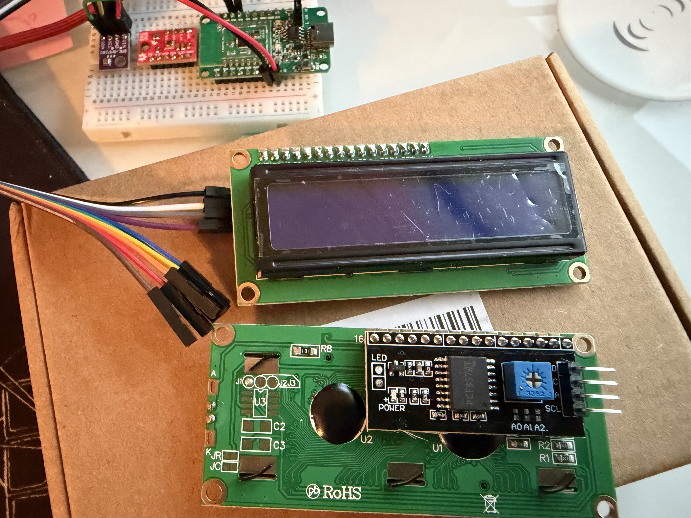
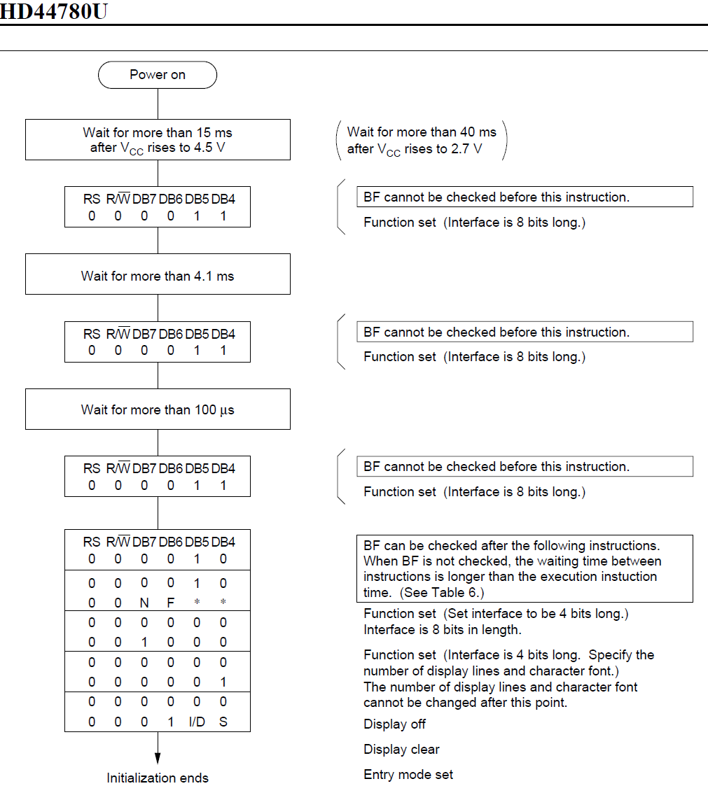

# display on I2C 1602 display module

In the BME 280 application, we show the temperature and humidity in UART log at
the host side. This is inconvenient because of the dependency. It would be better
that the data can show on display connected to the BL602 board directly. The simplest
solution is LCD display.

The one that I choose is 16x2 LCD module with I2C interface. Purchaced from Amazon,
the [1602 display module package](https://www.amazon.com/Hosyond-Display-Module-Arduino-Raspberry/dp/B0BWTFN9WF) comes
with 3 pieces. The product description is quite obscure:
```
Specifications:
Display: 2-lines x 16-characters
Four Pin Definition: GND, VCC, SDA, SCL
Default I2C bus address: 0x27 for F8574T chip
Working voltage: 5V
Adjust Backlight: Potentiometer

Package includes:
3 x LCD display
1 x 10pin F-M jumper wires
```



Therefore, I have to google the internet how to program this piece. Searching "i2c 1602 lcd
module datasheet" yields the [first
link](https://www.handsontec.com/dataspecs/module/I2C_1602_LCD.pdf). Along the review comments
from the product page, I can conclude the LCD display module uses the two controller: F8574T,
and HD44780. The first chip is for IO extention, and 2nd chip is the LCD controller. The data
sheet for HD44780 can be found
[here](https://academy.cba.mit.edu/classes/output_devices/44780.pdf).
From the reference connection diagram of the I2C-to-LCD piggy-back board, the mapping is as follows:

| PCF8574T  bit |   LCD pin  |    Function      |
|---------------|------------|------------------|
|   P0          |     RS     |  Register select |
|   P1          |     RW     |  Read/Write (1/0)|
|   P2          |     E      |    Enable        |
|   P3          | backlight  |  LCD control     |
|   P4          |     D4     |   Data bit       |
|   P5          |     D5     |   Data bit       |
|   P6          |     D6     |   Data bit       |
|   P7          |     D7     |   Data bit       |

A single character consists of 8 bits wide. This means in order to display one single character
we have to send high nible and low nible separately. The byte delivered to the LCD should be in
the format of
```
/--------------------------------------\
| D7 | D6 | D5 | D4 | BL | E | RW | RS |
\--------------------------------------/
```

- RS is to indicate whether the nible is for command (0)  or for data (1).
- RW is to indicate the operation. 1 for Read, 0 for Write.
- E is the enable singnal. NOTE: data on the line are latched on falling edge. So in order to
  generate the edge, the data have to be written twice. The first time with E = 1, and the 2nd
  time with E = 0.

As this is 2 line LCD display module with 16 characters each, the controller has a command to
set the cursor location. Here is the command format:

| DB7 | DB6 | DB5 | DB4 | DB3 | DB2 | DB1 | DB0 |
|-----|-----|-----|-----|-----|-----|-----|-----|
| 1   | A6  |  A5 |  A4 | A3  | A2  | A1  |  A0 |

The first line starting address is 0x0, and ending with 0xF. And the 2nd line address starts
with 0x40, and ends with 0x4F. For example, if you want to display a character at line 2,
position 5, you would need to use command 0x80 + 0x40 + 5 = 0xC5 to move the cursor to that
place.

Here are steps of writing a command 0xC5:
1. split the command byte into nibbles: 0xC, and 0x5
2. assemble the high nibble '0xC' into a byte with the bit of BL/E/RW/RS. RS should be 0 as this
   is command. E should be 1.
3. write the nibble to I2C
4. assemble the high nibble '0xC' into a byte with the bit of BL/E/RW/RS. RS should be 0 as this
   is command. E should be 0.
5. write the nibble to I2C.
6. repeat the step 2 ~ 5 for the lower nibble '0x5' again.

Before using the LCD display module, it has to be initialized. The figure next shows the
initialization sequence.


The steps of writing some text to display on the LCD module are similar to the steps of writing
command except RS being 1 instead of 0.

# The code

In the example we just fills the 16x2 LCD display with one line of characters starting from '0',
and the 2nd line of characters starting from 'A'.

```c
diff --git a/customer_app/bl602_boot2/Makefile b/customer_app/bl602_boot2/Makefile
index 26a4265d..1179a87b 100755
--- a/customer_app/bl602_boot2/Makefile
+++ b/customer_app/bl602_boot2/Makefile
@@ -20,6 +20,7 @@ $(info ****** Trying SDK PATH [$(BL60X_SDK_PATH)])
 endif
 
 INCLUDE_COMPONENTS += bl602 bl602_std
+INCLUDE_COMPONENTS += hal_drv freertos_riscv_ram utils blog cli yloop vfs blfdt loopset looprt bloop bl602_wifi
 INCLUDE_COMPONENTS += bl602_boot2
 
 include $(BL60X_SDK_PATH)/make_scripts_riscv/project.mk
diff --git a/customer_app/bl602_boot2/bl602_boot2/blsp_boot2.c b/customer_app/bl602_boot2/bl602_boot2/blsp_boot2.c
index 2e705dbc..c20e4ae9 100644
--- a/customer_app/bl602_boot2/bl602_boot2/blsp_boot2.c
+++ b/customer_app/bl602_boot2/bl602_boot2/blsp_boot2.c
@@ -36,6 +36,9 @@
 #include "blsp_boot_decompress.h"
 #include "blsp_common.h"
 #include "softcrc.h"
+#include <i2c_reg.h>
+#include <bl_i2c.h>
+#include <bl602_i2c.h>
 
 /** @addtogroup  BL606_BLSP_Boot2
  *  @{
@@ -378,6 +381,278 @@ static void BLSP_Boot2_Get_MFG_StartReq(PtTable_ID_Type activeID,PtTable_Stuff_C
  *  @{
  */
 
+#define I2C_TIMEOUT     (160 * 1000 * 2)
+static void dump_i2c(void) {
+    uint32_t val0 = BL_RD_REG(I2C_BASE, I2C_CONFIG);
+    uint32_t val1 = BL_RD_REG(I2C_BASE, I2C_INT_STS);
+    uint32_t val2 = BL_RD_REG(I2C_BASE, I2C_SUB_ADDR);
+    uint32_t val3 = BL_RD_REG(I2C_BASE, I2C_FIFO_CONFIG_0);
+    uint32_t val4 = BL_RD_REG(I2C_BASE, I2C_FIFO_CONFIG_1);
+    MSG_DBG("- 0x%08x 0x%08x 0x%08x 0x%08x 0x%08x \r\n",
+            val0,
+            val1,
+            val2,
+            val3,
+            val4
+            );
+}
+
+static void i2c_init_local(void) {
+    i2c_gpio_init(0); /* I2C port 0 */
+    i2c_set_freq(500, 0); /* 500 khz */
+    I2C_Disable(0); /* disable port 0 */
+    I2C_IntMask(0, I2C_INT_ALL, MASK);
+}
+
+static void i2c_stop_local(i2c_msg_t *p_msg) {
+    I2C_Disable(p_msg->i2cx);
+    I2C_IntMask(p_msg->i2cx, I2C_INT_ALL, MASK);
+    i2c_clear_status(p_msg->i2cx);
+}
+
+static int i2c_read_local(i2c_msg_t *p_msg) {
+    int ret_code = 0;
+    uint32_t timeout = 0;
+    uint32_t i = 0, j = 0, k = 0;
+    uint32_t val = 0;
+    uint32_t left = p_msg->len;
+
+    while(i < p_msg->len) {
+        timeout = 5000;
+        while (BL_GET_REG_BITS_VAL(BL_RD_REG(I2C_BASE, I2C_INT_STS), I2C_RXF_INT) == 0) {
+            timeout--;
+            ARCH_Delay_MS(1);
+            if (timeout == 0) {
+                MSG_ERR("\ntimeout in waiting rx_interrupt\r\n");
+                MSG_ERR("0x%08x 0x%08x 0x%08x 0x%08x\r\n",
+                    BL_RD_REG(I2C_BASE, I2C_BUS_BUSY),
+                    BL_RD_REG(I2C_BASE, I2C_INT_STS),
+                    BL_RD_REG(I2C_BASE, I2C_FIFO_CONFIG_1),
+                    BL_RD_REG(I2C_BASE, I2C_FIFO_CONFIG_0));
+                ret_code = -1;
+                goto fail;
+            }
+        }
+        val = BL_RD_REG(I2C_BASE, I2C_FIFO_RDATA);
+        if (left >=4)
+            j = 4;
+        else
+            j = left;
+        for (k = 0; k < j; k++) {
+            MSG_DBG("0x%02x ", (val >> (k * 8)) & 0xff);
+            p_msg->buf[p_msg->idex] = (val >> (k * 8)) & 0xff;
+            p_msg->idex++;
+        }
+        MSG_ERR("\r\n");
+        i = i + 4;
+        left -= j;
+    }
+
+    /* wait for I2C bus idle */
+    timeout = 5000; //I2C_TIMEOUT; // reload timeout value
+    while (BL_GET_REG_BITS_VAL(BL_RD_REG(I2C_BASE, I2C_BUS_BUSY), I2C_STS_I2C_BUS_BUSY) != 0) {
+        timeout--;
+        ARCH_Delay_MS(1);
+        if (timeout == 0) {
+            MSG_ERR("\ntimeout in waiting I2C idle\r\n");
+            ret_code = -1;
+            goto fail;
+        }
+    }
+
+fail:
+    return ret_code;
+}
+
+/* write transaction */
+static int i2c_write_local(i2c_msg_t *p_msg) {
+    int ret_code = 0;
+    uint32_t timeout = 0;
+    uint32_t i = 0;
+    uint32_t j = 0;
+    uint32_t val = 0x0;
+
+    timeout = I2C_TIMEOUT;
+    for (i = 0; i < p_msg->len; i++) {
+        val = val | (p_msg->buf[i] << ((i % 4) * 8));
+        j++;
+        p_msg->idex++;
+        if ((j % 4) == 0 || i == p_msg->len - 1) {
+            while (BL_GET_REG_BITS_VAL(BL_RD_REG(I2C_BASE, I2C_INT_STS), I2C_TXF_INT) == 0) {
+                timeout--;
+                if (timeout == 0) {
+                    MSG_ERR("\ntimeout in waiting tx_fifo space\r\n");
+                    ret_code = -1;
+                    goto fail;
+                }
+            }
+#if 0
+            MSG_DBG("val = 0x%x\r\n", val);
+#endif
+            BL_WR_REG(I2C_BASE, I2C_FIFO_WDATA, val);
+            j = 0;
+            val = 0;
+        } // if 4 bytes
+    } // for loop
+
+    /* XXX: why adding this dump helps the success of I2C write ??? */
+    dump_i2c();
+
+    /* wait for I2C bus idle */
+    timeout = I2C_TIMEOUT; // reload timeout value;
+    while (BL_GET_REG_BITS_VAL(BL_RD_REG(I2C_BASE, I2C_BUS_BUSY), I2C_STS_I2C_BUS_BUSY) != 0) {
+        timeout--;
+        if (timeout == 0) {
+            MSG_ERR("\ntimeout in waiting I2C idle\r\n");
+            ret_code = -1;
+            goto fail;
+        }
+    }
+
+fail:
+    return ret_code;
+}
+
+/*
+ * byte format to PCF8674: [D7 D6 D5 D4 BL E RW RS]
+ *
+ *  BL: back light
+ *  E: enable pulse
+ *  RW: read/write (1/0)
+ *  RS: register select (command or data)
+ */
+
+#define LCD_RS  0x01
+#define LCD_E   0x04
+#define LCD_BL  0x08
+
+#define RS_COMMAND 0x0
+#define RS_DATA    0x1
+void i2c_delay(void) {
+    ARCH_Delay_MS(1);
+    return;
+}
+
+void i2c_write_device(uint8_t address, uint8_t data) {
+    i2c_msg_t msg = {
+        .addr = address,
+        .direct = I2C_WRITE,
+        .subflag = 0,
+        .subaddr = 0,
+        .sublen = 0,
+        .buf = &data,
+        .len = sizeof (data),
+        .block = I2C_M_BLOCK,
+        .idex = 0,
+        .i2cx = 0,
+    };
+
+    i2c_init_local();
+    i2c_transfer_start(&msg);
+    i2c_write_local(&msg);
+    i2c_stop_local(&msg);
+
+    return;
+}
+
+/*
+ * function to implement latching data
+ * by creating high-to-low edge
+ */
+void lcd_pulse_enable(uint8_t data)
+{
+    i2c_write_device(0x27, data | LCD_E | LCD_BL);
+    i2c_delay();
+    i2c_write_device(0x27, (data & ~LCD_E) | LCD_BL);
+    i2c_delay();
+}
+
+void lcd_send_nibble(uint8_t nibble, uint8_t rs)
+{
+    uint8_t data = (nibble << 4);
+
+    if (rs)
+        data |= LCD_RS;
+
+    lcd_pulse_enable(data);
+}
+
+void lcd_send_byte(uint8_t byte, uint8_t rs)
+{
+    lcd_send_nibble(byte >> 4, rs);
+    lcd_send_nibble(byte & 0x0F, rs);
+}
+
+/*
+ * ref page 46 of HD44780 worksheet
+ */
+void lcd_init(void) {
+    lcd_send_nibble(0x03, RS_COMMAND);
+    /* wait for more than 4.1 ms */
+    i2c_delay();
+    lcd_send_nibble(0x03, RS_COMMAND);
+    /* wait for more than 100 us */
+    i2c_delay();
+    lcd_send_nibble(0x03, RS_COMMAND);
+    lcd_send_nibble(0x02, RS_COMMAND);
+
+    /* function set:
+     * [N F * *] = [1 1 0 0]
+     * N = 1: 2 lines
+     * F = 1: 5 * 10 dots
+     */
+    lcd_send_nibble(0x02, RS_COMMAND);
+    lcd_send_nibble(0x0C, RS_COMMAND);
+
+    /* display OFF */
+    lcd_send_nibble(0x00, RS_COMMAND);
+    lcd_send_nibble(0x08, RS_COMMAND);
+
+    /* display clear */
+    lcd_send_nibble(0x00, RS_COMMAND);
+    lcd_send_nibble(0x01, RS_COMMAND);
+
+    /* entry mode set:
+     * [1 I/D S] = [1 1 0]
+     */
+    lcd_send_nibble(0x00, RS_COMMAND);
+    lcd_send_nibble(0x0C, RS_COMMAND);
+}
+
+int test_lcd1602(void) {
+    uint8_t i = 0;
+
+    lcd_init();
+    MSG_DBG(" display now\r\n");
+    ARCH_Delay_MS(10000);
+    /* write 16 characters from '0' */
+    for (i = 0; i < 16; i++) {
+        lcd_send_byte('0' + i, RS_DATA);
+        ARCH_Delay_MS(2000);
+    }
+
+    /*
+     * the two commands for testing
+     * display off and display on
+     */
+    lcd_send_byte(0x08, RS_COMMAND);
+    ARCH_Delay_MS(10000);
+    lcd_send_byte(0x0C, RS_COMMAND);
+    ARCH_Delay_MS(10000);
+
+    MSG_DBG(" 2nd row \r\n");
+    /* set cursor to 2nd row command:
+     * 0x80 + 0x40 + 0 = 0xC0
+     */
+    lcd_send_byte(0xC0, RS_COMMAND);
+    /* write 16 characters from 'A' */
+    for (i = 0; i < 16; i++) {
+        lcd_send_byte('A' + i, RS_DATA);
+        ARCH_Delay_MS(2000);
+    }
+    return 0;
+}
+
 /****************************************************************************//**
  * @brief  Boot2 main function
  *
@@ -450,6 +725,9 @@ int main(void)
         cpuCount=1;
     }
 
+    ARCH_Delay_MS(5);
+    test_lcd1602();
+
     /* Get power save mode */
     psMode=BLSP_Read_Power_Save_Mode();
```

# The others

The default I2C address is 0x27 for the LCD 1602 display module. It can be changed by shortening
A2/A1/A0 on the back. That way more than one display module can be connected and addressed
to the same I2C port without conflicts.

Combined with the code in BME280, we can display the temperature/humidity on LCD display.
