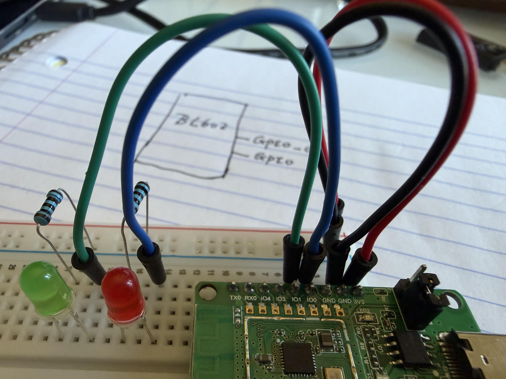

# light LEDs attached to GPIO

TODO: add more details on GPIO

We would use GPIO pin 0 and 1 to connect LEDs. Here is the connection.


```c
~/disk2/1208_bl_iot/bl_iot_sdk/customer_app/bl602_boot2$ git diff
diff --git a/customer_app/bl602_boot2/Makefile b/customer_app/bl602_boot2/Makefile
index 26a4265d..1179a87b 100755
--- a/customer_app/bl602_boot2/Makefile
+++ b/customer_app/bl602_boot2/Makefile
@@ -20,6 +20,7 @@ $(info ****** Trying SDK PATH [$(BL60X_SDK_PATH)])
 endif

 INCLUDE_COMPONENTS += bl602 bl602_std
+INCLUDE_COMPONENTS += hal_drv freertos_riscv_ram utils blog cli yloop vfs blfdt loopset looprt bloop bl602_wifi
 INCLUDE_COMPONENTS += bl602_boot2

 include $(BL60X_SDK_PATH)/make_scripts_riscv/project.mk
diff --git a/customer_app/bl602_boot2/bl602_boot2/blsp_boot2.c b/customer_app/bl602_boot2/bl602_boot2/blsp_boot2.c
index 2e705dbc..edb94541 100644
--- a/customer_app/bl602_boot2/bl602_boot2/blsp_boot2.c
+++ b/customer_app/bl602_boot2/bl602_boot2/blsp_boot2.c
@@ -36,6 +36,8 @@
 #include "blsp_boot_decompress.h"
 #include "blsp_common.h"
 #include "softcrc.h"
+#include <bl_timer.h>
+#include <bl602_gpio.h>

 /** @addtogroup  BL606_BLSP_Boot2
  *  @{
@@ -372,6 +374,32 @@ static void BLSP_Boot2_Get_MFG_StartReq(PtTable_ID_Type activeID,PtTable_Stuff_C
     }
 }

+static void my_gpio_light()
+{
+    GLB_GPIO_Cfg_Type cfg;
+    static uint32_t on = 1;
+
+    cfg.drive=0;
+    cfg.smtCtrl=1;
+
+    /* configure the GPIO_PIN_0 and PIN_1 */
+    cfg.gpioPin = GLB_GPIO_PIN_0;
+    cfg.gpioFun = GPIO0_FUN_SWGPIO_0;
+    cfg.gpioMode=GPIO_MODE_OUTPUT;
+    cfg.pullType=GPIO_PULL_UP;
+    GLB_GPIO_Init(&cfg);
+
+    cfg.gpioPin = GLB_GPIO_PIN_1;
+    cfg.gpioFun = GPIO1_FUN_SWGPIO_1;
+    cfg.gpioMode=GPIO_MODE_OUTPUT;
+    cfg.pullType=GPIO_PULL_DOWN;
+    GLB_GPIO_Init(&cfg);
+
+    GLB_GPIO_Write(GLB_GPIO_PIN_0, on);
+    GLB_GPIO_Write(GLB_GPIO_PIN_1, !on);
+    on = on? 0:1;
+}
+
 /*@} end of group BLSP_BOOT2_Private_Functions */

 /** @defgroup  BLSP_BOOT2_Public_Functions
@@ -450,6 +478,12 @@ int main(void)
         cpuCount=1;
     }

+    /* switch on/off light every second for 60 seconds */
+    for (uint32_t i = 0; i < 60; i++) {
+        my_gpio_light();
+        bl_timer_delay_us(1000 * 1000 * 1);
+    }
+
     /* Get power save mode */
     psMode=BLSP_Read_Power_Save_Mode();

(END)
```
