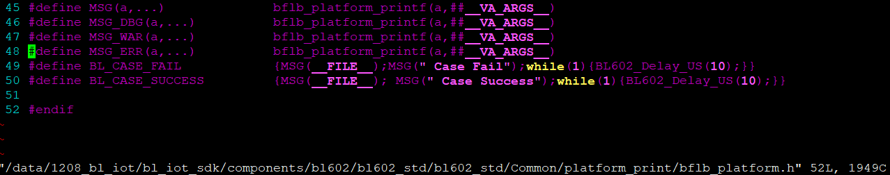
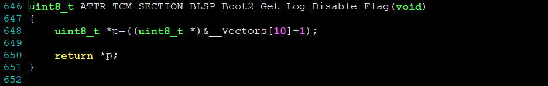

# Enable UART log in boot

UART logs is a primitive way for debugging. The logs show the
execution progress of code. Bootloader code for BL602 has several
places intended to give such a clue.

Before we hack the code to enable uart log for booting, let's see
how these UART logs get sent out, which swtich controls it. In the main
function of blsp_boot2.c, *MSG_DBG, MSG_WAR,*, and *MSG_ERR* are being
used to output some strings, at least appearingly. 

Trace the code backwards and conclude all of them are associated directly
to the function *bflb_platform_printf* with some exceptions.



Here is the code of *bflb_platform_printf*.
```c
193 void bflb_platform_printf(char *fmt,...)
194 {
195     static char print_buf[128];
196     va_list ap;
197     if(!uart_dbg_disable){
198         va_start(ap, fmt);
199         vsnprintf(print_buf, sizeof(print_buf)-1, fmt, ap);
200         va_end(ap);
201         bflb_platform_usart_dbg_send((uint8_t*)print_buf,strlen(print_buf));
202     }
203 }
```
The output is controlled behind the global variable *uart_dbg_disable*, and this
variable is set in the function of *bflb_platform_print_set* by taking the return
value of function *BLSP_Boot2_Get_Log_Disable_Flag()*. Here is the implementation
of function *BLSP_Boot2_Get_Log_Disable_Flag()*.



The flag is stored at the address of \_\_Vectors[10] plus 1 (see line 69).
```c
 58 const pFunc __Vectors[] __attribute__ ((section(".init"),aligned(64))) = {
 59     0,                               /*         */
 60     0,                               /*         */
 61     0,                               /*         */
 62     clic_msip_handler,               /*         */
 63     0,                               /*         */
 64     0,                               /*         */
 65     0,                               /*         */
 66     clic_mtimer_handler,             /*         */
 67     (pFunc)0x00000004,               /*         */
 68     (pFunc)0x00001007,               /*         */
 69     (pFunc)0x00010002,               /*         */
 70     clic_mext_handler,               /*         */
```

The value at this address is 0x00 (ZERO). oops, this means the uart log is not disabled!
We are all good, ;p. 

If you want to disable the log, you may change the value of line 69 to 0x00010102 instead.
